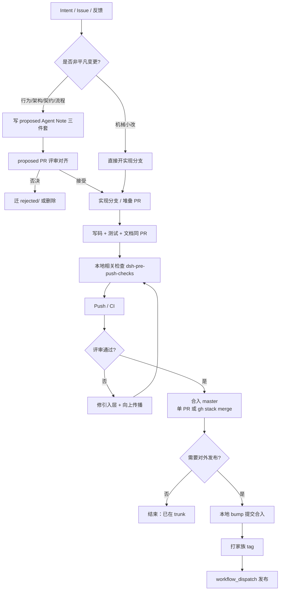
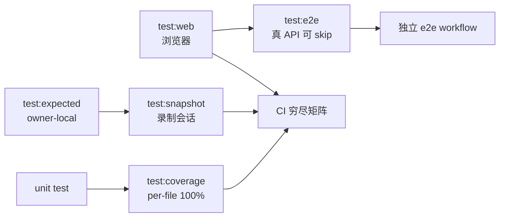
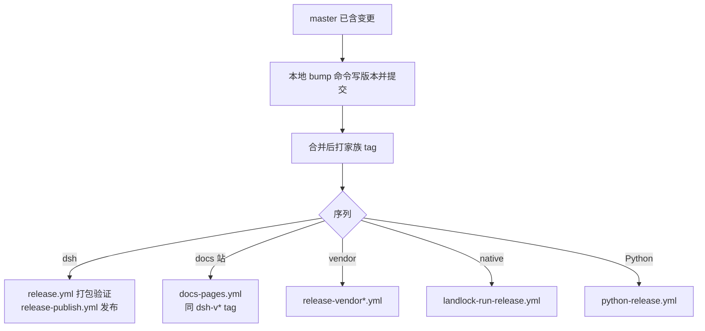

# 002 — 需求到发布全流程（ADLC 地图）

记录日期：2026-09-04

## 当前问题

从「有一个想法 / 需求」到「代码合入、测试通过、制品发布」，本仓库走哪些阶段？每阶段主要看什么规范、用什么工具？

## 结论（短答）

本仓交付不是线性瀑布，而是 **Agent Note 决策记录 + PR 堆叠实现 + 门禁证据 + 独立发布序列**。

```text
intent → proposed Note → 评审对齐 → 实现 PR（含 Note 迁 implemented）
      → 本地相关检查 → CI 穷尽矩阵 → 合入 master
      →（可选）bump + tag → 手动 dispatch 发布 npm / docs / Python / native
```

权威不在本 wiki：代码契约在 `AGENTS.md` / package README；决策在 Agent Notes；步骤在 cookbook / skills。

## 总览流程图



## 分阶段说明

### 1. 需求 / Intent

| 项 | 内容 |
|---|---|
| 输入 | 用户想法、Issue、评审反馈、postmortem、简化机会 |
| 澄清 | 现状问题、期望行为、可观察成功标准、刻意不做的事 |
| 分流 | 纯机械小改 → 直接实现；否则先 Agent Note |

Issue：原生 Issue Type（不用 `kind/*`）；可选 `area/*`；`source/*` 只标 Issue 来源。详见 [label taxonomy](../../.agents/notes/implemented/process/2026-08-08-unified-github-label-taxonomy.md)。

细流程见 [001-intent-to-proposed.md](001-intent-to-proposed.md)。

### 2. 提案（proposed）

```text
.agents/notes/proposed/<class>/YYYY-MM-DD-kebab-title.{md,zh.md,i18n.yaml}
```

| class | 用途 |
|---|---|
| `feature` | 用户/模型可见新能力 |
| `architecture` | 源码结构 / 运行时词汇 |
| `process` | 门禁、工具链、流程 |
| `testing` | 测试策略 / 基础设施 |
| `bug-fix` | 缺陷修复设计 |
| `simplification` | 删减不加能力 |

必填骨架：`Problem` → `Proposal` → `Alternatives considered` → `Acceptance criteria` → `Risks`。

规范 / 工具 / skill：

- [`.agents/notes/README.md`](../../.agents/notes/README.md)；细流程与 skill 表见 [001-intent-to-proposed.md](001-intent-to-proposed.md)
- **必调** [`dsh-archive-agent-notes`](../../.agents/skills/dsh-archive-agent-notes/SKILL.md)（新建 note 的 supersession；合格 implemented 同 PR 归档）
- `class=simplification` 时先 [`dsh-find-simplifications`](../../.agents/skills/dsh-find-simplifications/SKILL.md)
- Push 前 [`dsh-pre-push-checks`](../../.agents/skills/dsh-pre-push-checks/SKILL.md)
- `pnpm run verify-agent-note-format` / `verify-agent-note-classification`
- `pnpm run verify-translation-pairing --write <en.md>`
- `pnpm run doc-sync`（文档门禁总闸）
- **不要默认** `dsh-translate-docs`（仅用户显式调用）

### 3. 设计实现（实现 PR）

| 原则 | 权威 |
|---|---|
| 改 `packages/` 前读架构图 | [docs/architecture.md](../../docs/architecture.md) |
| 能力缝完整（Definition / Provider / Consumer） | [docs/glossary.md](../../docs/glossary.md) |
| 插件扩展，少动 agent-loop | 根 `AGENTS.md` |
| 生命周期 / 并发 / 子进程 | [docs/defensive-patterns.md](../../docs/defensive-patterns.md) |
| 新包 / 新工具 / 设置卡 | [docs/cookbook/](../../docs/cookbook/) |
| 文档放置与双语 | [docs/AGENTS.md](../../docs/AGENTS.md)、[dsh-doc](../../.agents/skills/dsh-doc/SKILL.md) |
| 散文契约质量 | [dsh-prose-standard](../../.agents/skills/dsh-prose-standard/SKILL.md) |

落地时同一 PR：**把 owning Agent Note 迁到 `implemented/`**，改 `Status`，`Proposal`→`Decision`，`Acceptance`→`Consequences`，用现在时描述已装船现实。

独立变更拆 PR；依赖链用 **GitHub native stack**（`A ← B ← C`），见 [dsh-merging-stacked-prs](../../.agents/skills/dsh-merging-stacked-prs/SKILL.md)。

PR 标签：恰好一个 `kind/*` + 至少一个 `area/*`。

### 4. 测试（分层）



| 层 | 命令 | 何时必须 |
|---|---|---|
| 单元 | `pnpm run test`（聚焦文件） | 行为变更 |
| 覆盖率门禁 | `pnpm run test:coverage` | CI 权威；本地按受影响源缩小 include |
| 期望输出 | `pnpm run test:expected` | CLI/过程期望无会话往返 |
| 会话快照 | `pnpm run test:snapshot` | 模型/产品用户可见非平凡变更 |
| Web | `pnpm run test:web` | UI/ARIA；Linux PR 门禁 |
| 真 API | `pnpm run test:e2e` | 有 `DEEPSEEK_API_KEY` 时证明真模型路径 |

策略权威：[docs/testing.md](../../docs/testing.md)。可靠性 / flake：[dsh-ci-test-reliability](../../.agents/skills/dsh-ci-test-reliability/SKILL.md)。

### 5. 本地检查 → Push → CI → 评审 → 合入

```text
change-scope --base <verified-base>
  → 选最小相关证据（勿默认全量）
  → commit（lefthook pre-commit）
  → push（lefthook pre-push = typecheck）
  → gh pr checks
  → 评审（dsh-code-review）
  → merge / gh stack merge
```

| 环节 | 工具 / 规范 |
|---|---|
| 选检查 | [dsh-pre-push-checks](../../.agents/skills/dsh-pre-push-checks/SKILL.md) |
| 范围报告 | `pnpm --silent run change-scope --base <ref>` |
| 文档 | `pnpm run doc-sync`；快速：`pnpm run test:docs` |
| 构建制品消费者 | `pnpm run build` + `pnpm run hygiene` |
| 本地 hooks | lefthook：`pre-commit`（oxlint/空白/配对/vendor）、`pre-push`（typecheck） |
| CI | `.github/workflows/ci.yml`；门禁清单 `scripts/run-gates.ts` |
| 评审 | [dsh-code-review](../../.agents/skills/dsh-code-review/SKILL.md) |
| 堆叠修评 | [docs/cookbook/responding-to-pr-review-on-a-stack.md](../../docs/cookbook/responding-to-pr-review-on-a-stack.md) |
| 合入堆叠 | `gh stack merge`（[dsh-merging-stacked-prs](../../.agents/skills/dsh-merging-stacked-prs/SKILL.md)） |

日常命令总表：根 [AGENTS.md](../../AGENTS.md)#Commands。贡献者环境：[docs/development.md](../../docs/development.md)。

### 6. 发布 / 部署

合入 master **不等于**对外发布。发布是 **显式 tag + 手动 workflow_dispatch**。



| 序列 | Tag | 说明 |
|---|---|---|
| dsh | `dsh-v<version>` | `packages/*/*` + `apps/*` 同版；restricted npm |
| 文档站 | 同 `dsh-v*` | Pages 仅从 release tag 部署，不跟 master push |
| vendor | `vendor-<pkg>-v*` | 框架包独立版本线；public |
| native | `landlock-run-v*` | Linux 平台包 |
| Python | `python-v*` | wheels；独立 workflow |

权威：[npm release sequences](../../.agents/notes/implemented/process/2026-08-10-npm-release-sequences.md)、[docs site tag release](../../.agents/notes/implemented/process/2026-08-21-documentation-site-tag-release.md)。

版本写入仓库由本地 bump；CI **不写回**仓库，只校验并上传。无本地 `npm publish` 路径。

## 规范与工具速查

### 站立规则（每会话）

| 文档 | 职责 |
|---|---|
| 根 [`AGENTS.md`](../../AGENTS.md) | 站立命令、约定、检查策略 |
| [`packages/AGENTS.md`](../../packages/AGENTS.md) | 包级 invariant / 插件规则 |
| [`docs/AGENTS.md`](../../docs/AGENTS.md) | 文档分层与预算 |
| [`.agents/notes/README.md`](../../.agents/notes/README.md) | Agent Note 生命周期 |

### Skills（可复用工作流）

| Skill | 何时用 |
|---|---|
| `dsh-pre-push-checks` | push / 标 ready / stack sync 后 |
| `dsh-code-review` | 审 PR |
| `dsh-merging-stacked-prs` | 落地堆叠 |
| `dsh-doc` | 写/改文档与网站投影 |
| `dsh-prose-standard` | 评论、文档、提示词质量 |
| `dsh-ci-test-reliability` | 资源占用 / 异步 / flake 测试 |
| `dsh-archive-agent-notes` | 新建 note 的 supersession 审计；归档合格的已装船 note |
| `dsh-translate-docs` | **仅用户显式调用** 的翻译流程 |
| `dsh-find-simplifications` | 找可删减面 |

### 常用命令

```sh
# 提案门禁
pnpm run verify-agent-note-format
pnpm run doc-sync

# 实现证据（按 diff 选最小集）
pnpm --silent run change-scope --base <base>
pnpm exec vitest run <owning-spec> --coverage --coverage.include='...'
pnpm run test:snapshot -t <name>
pnpm run typecheck   # 也由 pre-push 跑
pnpm run build && pnpm run hygiene

# 发布（人类操作；示例名以 package.json 为准）
# bump → merge → tag dsh-v* → Actions workflow_dispatch
```

### 门禁心智模型

| 层 | 做什么 | 不做什么 |
|---|---|---|
| pre-commit | 便宜缺陷：lint 修复、空白、配对、vendor manifest | 不全量测 |
| pre-push | `typecheck` | 不全量测 |
| 贡献者本地 | **一次**相关行为证据 | 默认 `check:all` |
| CI | 穷尽覆盖、制品烟测、Node 矩阵、平台 | — |
| 发布 workflow | pack / integrity / registry 幂等上传 | 不自动跟每个 merge |

## 端到端示例路径

功能想法「Turn usage 显示金钱消耗」：

1. Intent → proposed Note（见 [001](001-intent-to-proposed.md) 实例）
2. proposed PR 对齐 Acceptance
3. 实现 PR：Host/Client UI + i18n + 单元/快照 + Note 迁 `implemented/`
4. `change-scope` → 聚焦 test + `doc-sync`（若动文档）→ push
5. `dsh-code-review` / CI 绿 → merge
6. 需要用户装到 npm / 看到公开文档站时，再走 dsh bump + `dsh-v*` + dispatch

## 相关权威来源

- [001 — intent → proposed](001-intent-to-proposed.md)
- [Agent Notes](../../.agents/notes/README.md)
- [testing.md](../../docs/testing.md) / [development.md](../../docs/development.md)
- [quality gates](../../.agents/notes/implemented/process/2026-06-11-quality-gates.md)
- [npm release sequences](../../.agents/notes/implemented/process/2026-08-10-npm-release-sequences.md)
- Cookbook：[adding-a-package](../../docs/cookbook/adding-a-package.md)、[adding-a-tool](../../docs/cookbook/adding-a-tool.md)、[stack review](../../docs/cookbook/responding-to-pr-review-on-a-stack.md)
