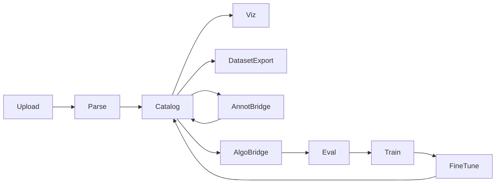
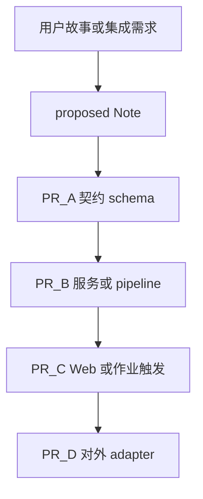

# 003 — 自动驾驶数据闭环：工程模板设计

记录日期：2026-09-04

## 当前问题

要把 [deepseek-harness](../../AGENTS.md) 的工程化当作**其他项目的开发模板**时，目标若是「自动驾驶数据闭环平台」（上传、解析、入库、可视化、数据集下载，并对接标注 / 算法 / 评测 / 训练 / 微调），应提取什么？如何适配多语言？本次只定设计，不建脚手架。

## 结论（短答）

**搬心智与流程，不搬 harness 产品。** 目标仓写成自己的 `AGENTS.md` + Agent Notes + 窄 hooks + 分语言 CI + **领域契约门禁**（schema / 数据集版本 / 血缘 / 作业幂等 / 集成契约测）。

默认假设（已选定）：

- 栈：**多语言** — Python（解析、批处理、训练侧 SDK）+ 后端服务（Go / Java / TS 择一作平台 API）+ Web（React / Vue）。
- 仓库：**优先 monorepo**；外部标注/训练集群用 adapter + 契约，必要时再拆对接仓。
- 产出节奏：本文档 → 确认后再脚手架（MVP 见文末）。

交付链仍对齐本 wiki [002](002-adlc-full-lifecycle.md)：Note → 实现 → 相关证据 → CI → 合入；（发布另议）。

## 1. 目标画像与默认决策

| 维度 | 默认 |
|---|---|
| 产品 | 数据闭环平台 + 多系统集成面 |
| 语言 | Python + 一服务端语言 + Web TS |
| 与 DSH | 只继承流程 / 门禁分层 / Agent 工作流；禁止拷贝 Cordis、Typert、`dsh` CLI、session 快照体系、vendor/rescope |
| 共享核 | 身份权限、对象存储抽象、数据集/版本/血缘 schema、作业编排、审计 — **禁止**膨胀成「大中台神包」 |

## 2. 平台模块地图



| 模块 | 拥有 | 禁止泄漏 | 对外方式 |
|---|---|---|---|
| Upload | 接入校验、上传会话、原始对象指针 | 解析语义、标注格式 | 上传 API / 事件 `raw.accepted` |
| Parse | 解码、同步、标定绑定、规范化片段 | UI、训练超参 | 作业结果写 Catalog；schema 版本化 |
| Catalog | 资产索引、metadata、revision、血缘边 | 重计算、重训 | 查询 API；不可变 revision id |
| Viz | 只读浏览、投影 | 写权威库、改血缘 | 读 Catalog / 派生视图 |
| DatasetExport | 打包、权限、导出审计 | 改源 revision | 导出作业 + 清单哈希 |
| AnnotBridge | 标注平台鉴权、任务映射、回写适配 | 通用 Catalog 写路径绕过桥 | 契约 API + fixture |
| AlgoBridge | 特征/推理作业触发与结果登记 | 训练循环内聚 | 同上 |
| Eval | 指标定义、跑次、报告 revision | 静默改评测定义而不升版 | 指标 schema + run id |
| Train / FineTune | 训练作业、产物登记回 Catalog | 直接改历史 dataset 内容 | 引用 dataset revision；产物新 revision |

**集成铁律：** 模块之间用 **稳定 API / 事件 + 版本化 schema**，禁止跨模块深层库内 import「图省事」。

## 3. 从 DSH 提取清单

### A. 心智（必提，几乎零改）

| 原则 | 本仓来源 | 写入目标仓 |
|---|---|---|
| 能脚本化的规矩必须有 fail 命令 | [quality gates](../../.agents/notes/implemented/process/2026-06-11-quality-gates.md) | `AGENTS.md` |
| hooks 便宜；CI 穷尽；Agent 跑相关证据 | [fast local hooks](../../.agents/notes/implemented/process/2026-07-22-fast-local-git-hooks.md) | lefthook + CONTRIBUTING |
| 非平凡变更必有决策记录 | [Agent Notes](../../.agents/notes/README.md) | `.agents/notes/` |
| 拆独立变更；依赖链可堆叠 | 根 [AGENTS.md](../../AGENTS.md) | PR 政策 |
| 选最小相关检查，不默认全量 | [dsh-pre-push-checks](../../.agents/skills/dsh-pre-push-checks/SKILL.md) | skill：`pre-push-checks` |

### B. 工具骨架（重写适配，勿整文件拷贝）

| 能力 | 适配 |
|---|---|
| pnpm/workspace 或等价多包 | 可混 `apps/` + `packages/` + `pipelines/`；Python 用 uv/poetry 工作区 |
| lefthook | pre-commit：各语言 formatter/linter（staged）；空白检查；pre-push：受影响面的 typecheck/编译 |
| 测试 | 每语言单元测；覆盖率阈值自定（DSH per-file 100% 对本平台通常过激，从包/关键路径起步） |
| CI lanes | `lint-py` / `lint-ts` / `test-py` / `test-svc` / `test-web` / `schemas` 并行；真数据 night job 独立 |
| 门禁聚合 | 一个 `make check` 或 `scripts/run-gates` **简化版**（按 path 选 lane），不要抄 DSH Host/Client/Typert 图 |

### C. Agent 协作层

| 项 | 说明 |
|---|---|
| Notes | `proposed/` → `implemented/` → `rejected/`；格式门禁自写轻量脚本 |
| Skills（去 `dsh-`） | `pre-push-checks`、`code-review`；可选 `merging-stacked-prs` |
| 领域 skill | **`data-contract-review`**：审 schema 兼容、revision、血缘、脱敏、导出审计 |

### D. 明确不提取

Cordis / Typert / `@Remote` / `dsh` profile / session 录制快照 / Client UI i18n 全套 / vendor rescope / landlock / 本仓 50+ 条点名 `packages/*/*` 的 `verify-*`。

可保留的**类比**（自行实现）：「有密钥才跑的真环境测可自 skip」（见 [testing.md](../../docs/testing.md) 真 API 政策）。

## 4. 领域专属工程化（模板差异化）

这些是 DSH 没有、数据闭环必须自建的门禁与约定：

1. **Schema / 格式门禁**
   传感器包、标定、标注结果、评测指标均有版本化 schema（建议单一事实来源目录 `schemas/`）。CI 用小 fixture 跑兼容性：同主版本可加字段；破环变更必须升主版本并写 Note。

2. **数据集版本与血缘**
   Dataset **revision 不可变**。解析 / 标注回写 / 训练 / 微调只引用 revision id。禁止文档或脚本依赖「最新目录」「默认 bucket 头」。血缘边进入 Catalog（谁由谁生成）。

3. **作业幂等与重跑**
   解析/入库以 content-hash 或 `(job_type, input_revision, config_hash)` 去重。失败日志足够本地复现；重跑不产生静默双份权威行（或明确标记 supersede）。

4. **集成契约测试**
   Annot / Algo / Eval / Train 桥接：`contract fixture + mock server`。单元测与 PR CI **不**打真标注集群或真 GPU 队列。

5. **大数据路径**
   默认测用 MB 级 fixture。真车数据 / 全量回归进 nightly 或需凭证的 job；无凭证自 skip，不挡 PR 绿。

6. **安全与合规**
   脱敏规则进契约；导出要审计；密钥与车端隐私只走环境 / 密钥管理，永不进 git（对齐本仓 `.env` 政策）。

## 5. Coding Agent 分工



| 规则 | 做法 |
|---|---|
| 默认 | **一条垂直切片**（同一 Agent 或同一会话）：契约 → 实现 → UI/触发 → 测与文档 |
| 不要 | 长期「前端 Agent / 后端 Agent」各发明字段 |
| 宜堆叠 | 契约先合审；UI 很大；多 adapter 并行时以 **契约 PR 为底** |
| 对接系统 | adapter 独立包 + 契约测；主平台与 adapter 可两人并行，接口以 `schemas/` + contract 为准 |

前后端是否拆开：**按变更是否独立与可评审**，不按工种。详见会话结论；全流程见 [002](002-adlc-full-lifecycle.md)。

## 6. 目标仓推荐目录（示意）

已实现的 MVP 树见 [`../data-loop-template/`](../data-loop-template/)。推荐布局：

```text
AGENTS.md
.agents/notes/{proposed,implemented,rejected}/
.agents/skills/{pre-push-checks,code-review,data-contract-review}/
apps/                 # api / web / workers（MVP 占位）
packages/             # 共享客户端、adapter、纯库（MVP 占位）
pipelines/            # Python 解析与批处理
schemas/              # 版本化数据契约（单一事实来源）
docs/{architecture,development,testing,integrations}/
.github/workflows/
lefthook.yml
```

`docs/integrations/` 每对接系统一页：鉴权、幂等、错误码、fixture 位置、谁拥有 schema。

## 7. MVP → 演进

| 阶段 | 内容 |
|---|---|
| **MVP 脚手架** | 已落在 [`../data-loop-template/`](../data-loop-template/)：`AGENTS.md` + Notes + 3 skills + lefthook + CI（schemas/Python）+ `schemas/` 例 + 假闭环 fixture 测。可整目录拷出成独立 git 仓。 |
| **下一阶段** | contract tests 骨架、dataset revision API、环境晋升（dev→staging）说明 |
| **再后** | 全量域门禁、nightly 真数据、多仓发布 / 制品签名 |

验收：不熟 DSH 的 coding agent **只读目标仓** `AGENTS.md` + skills，能走完「提案 Note → 实现 → 相关检查 → PR」，且改 schema 时会触发契约门禁。

## 8. 相关权威来源（原则，非复制实现）

- 本 wiki：[001 intent→proposed](001-intent-to-proposed.md)、[002 全流程](002-adlc-full-lifecycle.md)
- 根 [AGENTS.md](../../AGENTS.md) — 站立命令与检查策略
- [Agent Notes](../../.agents/notes/README.md) — 决策记录生命周期
- [docs/testing.md](../../docs/testing.md) — 分层测试与「有密钥才跑」类比
- [docs/development.md](../../docs/development.md) — hooks / CI 分工类比
- Skills 流程参考：`dsh-pre-push-checks`、`dsh-code-review`、`dsh-merging-stacked-prs`（目标仓应改名并删 DSH 路径）

**实现必须在目标仓重写。** 本 deepseek-harness 的 `scripts/verify-*.ts` 硬编码本仓布局，直接拷贝会失败且会把无关产品约束带进数据平台。
