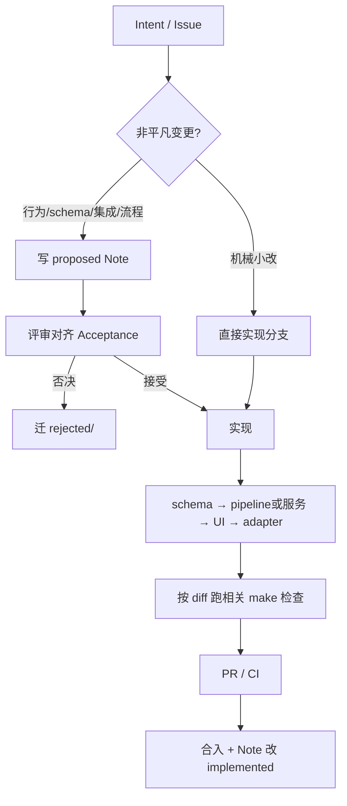

# 004 — data-loop-template 需求开发流程

记录日期：2026-09-04

## 当前问题

[`adlc/data-loop-template`](../data-loop-template/) 这个（可拷出的）目标仓脚手架，**需求开发流程**是什么？从想法到合入走哪些步骤？

## 结论（短答）

权威在模板仓自身的 [`AGENTS.md`](../data-loop-template/AGENTS.md)，不是本 wiki。流程是：

```text
想法 / Issue
  → 判定是否非平凡
  → proposed Agent Note（对齐 Acceptance）
  → 实现（垂直切片；大变更按 schema → pipeline/服务 → UI → adapter 堆叠）
  → 本地相关检查（pre-push-checks）
  → PR + CI
  → 合入（Note 迁 implemented/）
```

与 DSH 全流程（[002](002-adlc-full-lifecycle.md)）同构，但 **MVP 无 npm 发布序列**；契约门禁以 `schemas/` + fixtures 为中心。

## 流程图



## 分阶段

### 1. 澄清需求

写清：现状问题、期望行为、可观察验收、刻意不做的事。凡对接标注 / 算法 / 评测 / 训练，必须落到 **版本化 schema**，禁止依赖「最新目录」。

### 2. 提案（非平凡）

路径（相对模板仓根）：

```text
.agents/notes/proposed/<class>/YYYY-MM-DD-kebab-title.md
```

Suggested classes：`feature` / `architecture` / `process` / `testing` / `bug-fix` / `simplification` / `integration`。

骨架：`Problem` → `Proposal` → `Alternatives considered` → `Acceptance criteria` → `Risks`。
格式权威：[`.agents/notes/README.md`](../data-loop-template/.agents/notes/README.md)。

机械重命名、笔误可免 Note。

### 3. 实现与分工

| 规则 | 做法 |
|---|---|
| 默认 | 一条垂直切片（契约到可用路径）；同一 Agent/会话端到端 |
| 不要 | 长期「前端 Agent / 后端 Agent」各发明字段 |
| 宜堆叠 | `schema` ← `service/pipeline` ← `UI/触发` ← `对外 adapter` |
| 改契约 | 跟 [data-contract-review](../data-loop-template/.agents/skills/data-contract-review/SKILL.md)：同主版本只加可选字段；破坏性变更升 `vN` 并更新 fixture |

### 4. 本地检查 → PR → CI

| 环节 | 做什么 |
|---|---|
| lefthook | 便宜检查（空白；触及 schema/fixtures 时跑 verifier） |
| push 前 | [pre-push-checks](../data-loop-template/.agents/skills/pre-push-checks/SKILL.md)：按 diff 选最小证据 |
| 不确定时 | `make check`（schemas + notes + pytest） |
| CI | `.github/workflows/ci.yml`：schemas 车道 + Python tests |
| 评审 | [code-review](../data-loop-template/.agents/skills/code-review/SKILL.md)；契约变更再加 data-contract-review |

Diff 选检查速查：

| 改动 | 命令 |
|---|---|
| `schemas/**` / `fixtures/**` | `make check-schemas` |
| `pipelines/**` | `make test` |
| Agent notes | `python3 scripts/verify_agent_notes.py` |
| docs only | 可读性 / 链接；除非文档声称命令否则不必全量 pytest |

### 5. 合入后

Owning Note **移动到** `implemented/`，`Status: implemented`，正文改为现在时的 `Decision` / `Consequences`；不要留 proposed 副本。

## 与需求相关的硬约束

| 约束 | 含义 |
|---|---|
| Schema 单一事实来源 | 合同在 `schemas/`；代码/文档不另起权威 |
| Dataset revision 不可变 | 训练/导出只引用 revision id |
| 集成用 adapter + fixture | PR 不依赖真标注集群 / 真 GPU |
| 密钥与车端隐私不进仓 | 真数据 job 无凭证应自 skip |

## 相关权威来源

- 模板仓：[AGENTS.md](../data-loop-template/AGENTS.md)、[docs/development.md](../data-loop-template/docs/development.md)、[docs/testing.md](../data-loop-template/docs/testing.md)
- 设计：[003 工程模板设计](003-ad-data-loop-eng-template.md)
- DSH 类比全流程：[002](002-adlc-full-lifecycle.md)；intent→proposed 细步骤：[001](001-intent-to-proposed.md)（DSH 双语三件套；模板仓 MVP 目前为单语 Note）
