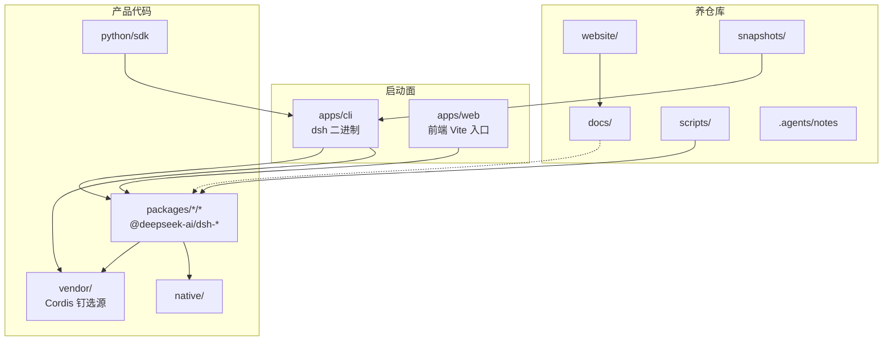
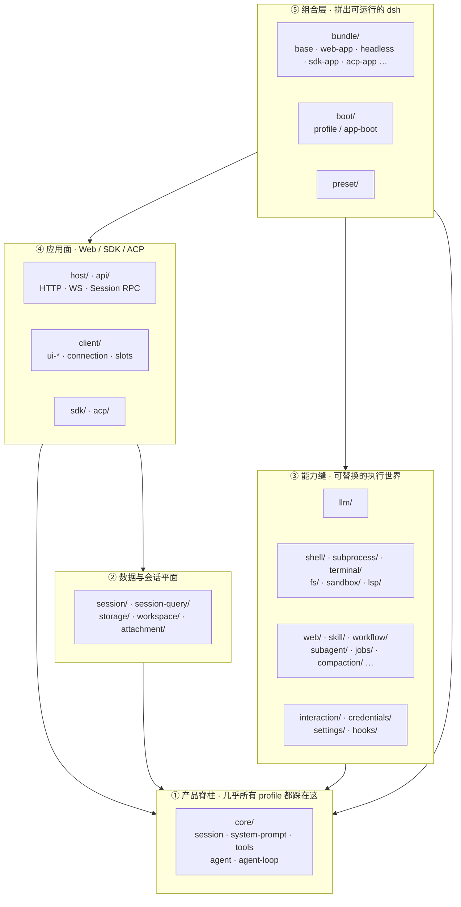
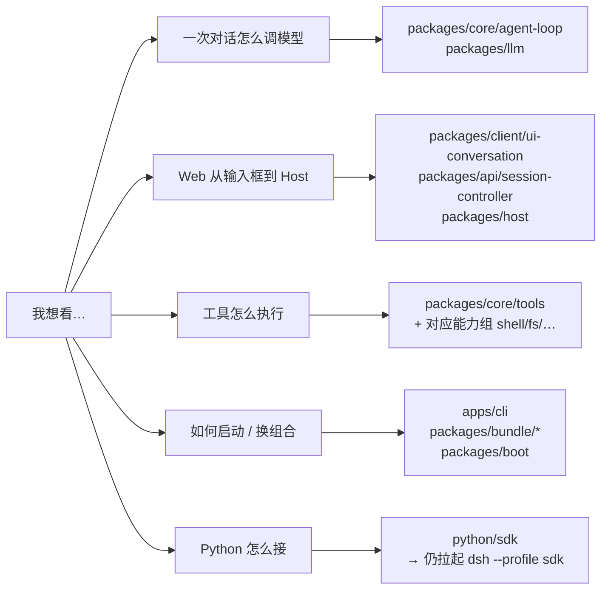

# 002 · 目录结构与架构图

> DeepSeek Harness 源码专题 · 第 2 篇
> 接 [001 · 一次 hi 对话的源码之旅](./001-一次hi对话的源码之旅.md) · 流程总览见 [000](./000-当前项目开发流程.md)
> 先认路，再跟读

上一篇顺着 `hi` 走了一条调用链。
打开仓库，你会看到几十个顶层目录、上百个 npm 包——没有地图很容易迷路。

本文做两件事：

1. **按职责拆开仓库顶层目录**（哪些是产品代码，哪些是文档/测试/工具）
2. **给 `packages/` 画分层架构图**（跟读源码时该从哪一层进）

事实来源：当前 checkout 的目录布局，以及 `packages/README.md` / `docs/architecture.md`。

---

## 1. 仓库顶层：先分「跑什么」和「怎么养仓库」

```text
deepseek-harness/
├── apps/           # 可启动的应用面（dsh CLI、Web 前端装配）
├── packages/       # ★ 产品主体：按能力分组的 @deepseek-ai/dsh-* 包
├── python/         # Python SDK + 随附 runtime 轮子
├── native/         # 原生扩展源码（如 Landlock）
├── vendor/         # 钉死的 Cordis 等上游源码副本
├── docs/           # 官方架构/教程/生成目录（权威文档）
├── website/        # VitePress：把部分 docs 投成站点
├── scripts/        # CI 门禁、生成器、仓库卫生检查
├── snapshots/      # 无钥匙录制会话回放（产品可见行为回归）
├── patches/        # pnpm patch
├── .agents/        # Agent Notes + 仓库技能（给人和 agent 的决策记录）
├── wiki/           # 本专题稿（非官方 docs 门禁范围）
├── AGENTS.md       # 站立规则（agent/开发者每次会话都该看见）
├── package.json    # pnpm workspace 根脚本
└── pnpm-workspace.yaml
```

用一张关系图看「谁依赖谁」：



| 目录 | 读源码时的角色 |
|---|---|
| `apps/` | 找「进程从哪启动」：`dsh web` / `dsh --profile …` |
| `packages/` | **主战场**：几乎所有业务与能力都在这里 |
| `vendor/` | Cordis 框架本体；改 harness 行为通常不改这里 |
| `docs/` | 官方地图；和代码冲突时以代码+Agent Note 为准，文档应跟进 |
| `scripts/` / `snapshots/` | 不解释「一次对话怎么跑」，但解释「仓库如何不漂」 |
| `wiki/` | 专题连载；非正式权威 |

Workspace 声明在 `pnpm-workspace.yaml`：包路径是 **`packages/*/*`**（组目录 → 包目录），外加 `apps/*`、`vendor/*`、`native/…`、`python/sdk-runtime`、`website`。

---

## 2. `apps/`：两个启动相关目录

```text
apps/
├── cli/    # dsh CLI：解析 argv、加载 profile、boot Cordis 树
└── web/    # Web 前端构建入口（Vite）；运行时插件仍来自 packages/client/*
```

对照上一篇：

- `pnpm dsh web` → **`apps/cli`** 以 `--profile web` boot
- 浏览器打开的页面产物来自 **`apps/web` + `packages/client/*`**
- 真正 `followup` / `llm.stream` 仍在 Host 进程里的 **`packages/core` + `packages/llm`**

`apps/` 薄，`packages/` 厚——这是刻意的：可换 UI / 可换 profile，spine 留在包里。

---

## 3. `packages/`：一张分层架构图

每个包是 `@deepseek-ai/dsh-<name>`，落在 **恰好一个组目录** 下：

```text
packages/<group>/<pkg>/
```

组很多（`core`、`llm`、`client`、`bundle`…）。按「读源码的优先级」压成五层，比按字母扫目录更有用：



### ① 脊柱：`packages/core`

上一篇 `hi` 的主戏大多在这里：

| 包 | 职责 | 常见 `ctx` |
|---|---|---|
| `session` | 追加写 Session 事件日志 | `ctx.sessions` |
| `system-prompt` | 拼系统提示与工具 schema | `ctx.systemPrompt` |
| `tools` | 工具注册与执行管线 | `ctx.tools` |
| `agent` | `Agent` 句柄与 `agent/*` 事件 | `ctx.agents` |
| `agent-loop` | 默认驱动：`turn` / `step` | `ctx.agentLoop` |
| `scope` | 按 agent 隔离注册 | （库，无 key） |

扩展产品时：优先依赖 **`agent` 合同**，不要绑死 `agent-loop` 实现——驱动可换。

### ② 会话数据平面：`session/` 等

`core/session` 管「运行中的日志抽象」；`packages/session/*` 管 **持久化、投影、标题、上报** 等数据面。
查历史、全文检索再看 `session-query/`。跟读「一次对话」可后读；做存储/导出时再进。

### ③ 能力缝（Capability Seams）

一组完整能力通常是三角色：

**Service Definition → Provider → Consumer（常是面向模型的 tool）**

| 组 | 你在找什么 |
|---|---|
| `llm/` | `ctx.llm`、DeepSeek 等 adapter |
| `shell/` `subprocess/` `terminal/` | Bash / 进程树 / 持久 PTY |
| `fs/` `sandbox/` `lsp/` | 文件、沙箱、语言服务 |
| `web/` `skill/` `workflow/` `subagent/` | 联网、技能、工作流、委派 |
| `interaction/` | 审批、权限、命令、ask-user |

换 provider（例如执行世界指到远程沙箱）而不改 tool 合同，是这层的设计目标。

### ④ 应用面：Web / SDK / ACP

```text
packages/host/*      # Web Host：webserver、路由等
packages/api/*       # SessionController、gateway、BFF
packages/client/*    # 浏览器：connection、ui-conversation、ui-chat…
packages/sdk/*       # 进程外 JSON-RPC SDK
packages/acp/*       # Agent Client Protocol 自动化面
```

上一篇「浏览器 → HTTP → `Commands.prompt` → `followup`」就落在 **`client` + `api` + `host`**；进 Agent 之后回到 **`core`**。

`client/` 包数量最多（几十个 `ui-*`），但跟读模型调用不必先扫完——从 `ui-conversation` / `session-controller` 的 client 半边进即可。

### ⑤ 组合层：`bundle/` + `boot/`

```text
packages/bundle/
├── base/          # web / headless / sdk / acp 共享第一层
├── web-app/       # 叠上浏览器应用
├── headless/      # 一次性任务、无 UI
├── sdk-app/
├── sdk-minimal/   # 刻意不叠 base 的完整小树
└── acp-app/
```

Profile = 按顺序打上的 patch 层（bundle → profile 补丁 → home 补丁 → `--patch`）。
`packages/boot/` 提供加载 profile、拼树的胶水。

**读源码技巧：** 想知道「默认装了哪些插件」，打开对应 bundle 的 `cordis.patch.yml`，比在 `packages/` 里猜更快。

---

## 4. 按「跟读目标」选入口（实用索引）



与上一篇路径的目录对照：

| 阶段 | 主要目录 |
|---|---|
| `dsh web` 启动 | `apps/cli` → `packages/boot` → `packages/bundle/{base,web-app}` |
| Composer 发送 | `packages/client/ui-conversation` |
| HTTP `session/prompt` | `packages/client/connection` · `packages/api/*` · `packages/host/*` |
| `followup` / turn / step | `packages/core/agent-loop` |
| 拼 prompt | `packages/core/system-prompt` |
| 调模型 | `packages/llm/llm` · `packages/llm/llm-deepseek` |
| 回推 UI | `packages/api/session-controller`（`history.follow`）· `packages/client/ui-chat` |

---

## 5. 其他顶层目录（知道用途即可）

| 路径 | 一句话 |
|---|---|
| `python/` | Python 客户端；默认拉起同版本 `dsh --profile sdk` |
| `native/` | 需原生编译的能力源码（如 Landlock） |
| `vendor/` | Cordis 生态钉选源；同步流程见 `vendor/README.md` |
| `docs/` | 架构、子系统、cookbook、生成目录（`config-catalog` 等） |
| `website/` | 文档站构建 |
| `scripts/` | `verify-*`、`gen-*`、聚合门禁 |
| `snapshots/` | 录制会话回放；改模型/用户可见输出时常要更新 |
| `.agents/notes/` | 决策记录（为什么这样设计） |
| `.agents/skills/` | 仓库内可复用工作流 |

---

## 6. 心智模型：目录 ≈ 插件能力的货架

DeepSeek Harness 宣称 **一切皆插件**。目录布局服务这件事：

1. **`packages/<能力组>/`** — 货架分区（llm、shell、fs…）
2. **`packages/bundle/`** — 进货单（profile 默认挂哪些插件）
3. **`apps/cli`** — 收银台（解析 profile，boot 整棵树）
4. **`docs/` + `.agents/notes/`** — 说明书与设计决议

所以看目录时，不要问「哪个文件夹是 main.rs」，而要问：

> 这个能力的 **定义 / 提供 / 消费** 分别在哪个组？
> 哪个 **bundle** 把它挂进了 `web`？

---

## 小结

- **顶层**：`apps` 启动，`packages` 实现，`docs`/`scripts`/`snapshots` 养仓库。
- **`packages`**：用五层读——脊柱 `core` → 会话数据 → 能力缝 → Web/SDK 面 → `bundle` 组合。
- **跟 `hi`**：入口在 `client`/`api`，组织调模型在 `core`/`llm`，组合真相在 `bundle/*/cordis.patch.yml`。

完整组名表以 [`packages/README.md`](../packages/README.md) 为准；本文是公众号向的压缩地图，不替代官方包组清单。

---

## 系列导航

- [000 · 当前项目开发流程](./000-当前项目开发流程.md)
- [001 · 一次 hi 对话的源码之旅](./001-一次hi对话的源码之旅.md)
- [003 · 解剖 apps/web 前端仓库](./003-解剖apps-web前端仓库.md)
- [004 · Web UI 双进程与 dual-face](./004-Web-UI双进程与dual-face.md)

可在目录地图之上继续拆：Capability Seam 解剖（以 `shell` 或 `llm` 为一组三角色）。

---

*本文为 wiki 专题稿；包组增删以仓库 `packages/README.md` 与当前目录为准。*
