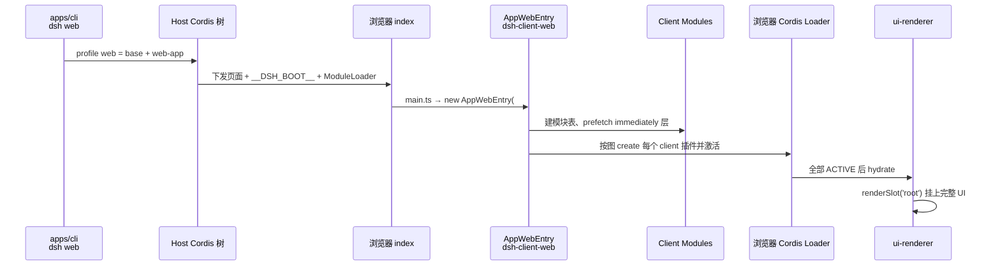
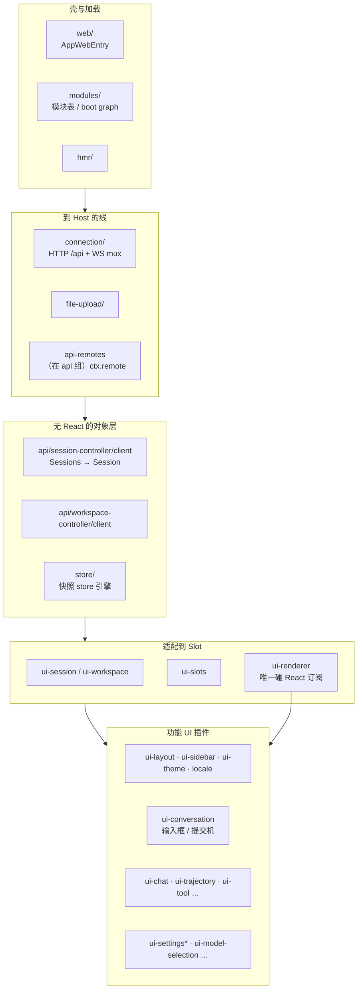
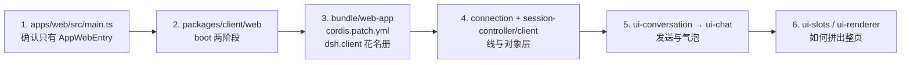

# 003 · 解剖 apps/web：前端仓库到底在哪

> DeepSeek Harness 源码专题 · 第 3 篇
> 接 [002 · 目录结构与架构图](./002-目录结构与架构图.md) · 呼应 [001 · hi 对话](./001-一次hi对话的源码之旅.md) · 流程见 [000](./000-当前项目开发流程.md)

很多人打开仓库找「前端项目」，第一眼会进 `apps/web`。
打开 `src/`，却只看到几行 TypeScript——这不是仓库坏了，而是 **设计如此**。

本篇先拆穿一个误会，再给你一张真正能跟读的前端地图。

---

## 先说结论

| 你以为 | 实际 |
|---|---|
| `apps/web` = 完整 React 应用 | `apps/web` = **Vite 打包壳** + e2e 车道 |
| 页面逻辑都在 `apps/web/src` | 页面逻辑在 **`packages/client/*`**（几十个 Cordis 浏览器插件） |
| `vite` / `pnpm --filter … dev` 就能看 UI | **必须** `dsh web`：Host 注入 `window.__DSH_BOOT__`；裸 Vite serve 会被配置直接拒绝 |

一句话：

> **`apps/web` 是入口与产物目录；前端产品代码的货架在 `packages/client/`。**

---

## 1. `apps/web` 目录里有什么

```text
apps/web/                          # 包名 @deepseek-ai/dsh-web-frontend
├── index.html                     # #root + 引入 /src/main.ts
├── src/
│   ├── main.ts                    # ★ 全部业务入口就这几行
│   ├── preview.ts                 # 实验性 WebWorker 预览入口（旁路）
│   ├── node-module-stub.ts        # 构建垫片
│   └── vite-env.d.ts
├── public/                        # 静态资源（favicon、manifest…）
├── vite.config.ts                 # 构建；禁止 standalone serve
├── dist/                          # Vite 产物；由 dsh web / web-runtime 托管
├── tests/                         # Playwright：真实 web 组合 + 真 Chromium
└── stress-tests/                  # 压力场景
```

业务入口全文几乎就是：

```ts
// apps/web/src/main.ts
import { AppWebEntry } from '@deepseek-ai/dsh-client-web'

const el = document.getElementById('root')
if (el === null) throw new Error('web app: missing #root')
void new AppWebEntry(el).run()
```

没有路由表、没有页面组件树、没有 `App.tsx`。
真正的「应用」在 `AppWebEntry.run()` 里被 **加载并激活一整棵 Client 插件图**。

`package.json` 自己也写明了定位：

> Vite build over the `@deepseek-ai/dsh-client-web` shell library；`dist/` served by `apps/cli`'s `dsh web`.

---

## 2. 为什么不能单独 `vite` 起前端

`vite.config.ts` 里有插件 `rejectStandaloneServe`：一旦 `vite` / `vite preview` 以 serve 模式启动，直接抛错，大意是：

> `apps/web` 不是独立应用：裸 Vite **无法**注入 `window.__DSH_BOOT__`。
> 请用 `pnpm dsh web`；要 Client HMR 时再并行 `pnpm run dev:web`。

浏览器要能跑起来，Host 必须先准备好两样东西（由 `dsh-web-app` / `dsh-client-modules` 等写入页面）：

| 全局 | 作用 |
|---|---|
| `window.__DSH_BOOT__` | 本次进程组装出的 **浏览器插件花名册**（boot graph） |
| `window.__ModuleLoader__` | 模块表门面：按图加载 `/plugins/<id>/client.js` |

没有这两者，`AppWebEntry` 无处可加载插件，只会停在启动页或报错——所以 **前端永远挂在 `dsh web` 这条 Host 进程上**。

本地常见组合：

```sh
pnpm dsh web              # Host + 托管已构建的 dist
pnpm run dev:web          # 可选：watch 重建 client 包，配合 client-hmr
```

---

## 3. 启动链路：从 HTML 到 Slot 树



两阶段 boot（`packages/client/web`）：

1. **Module stage**：采纳 Host 预置的 bootstrap，建共享模块表（React / Cordis / 静态 UI 库等 `PLATFORM_MODULES`），预取 `immediately` 批次
2. **Plugin stage**：挂上 Cordis Loader，**等每一个** `dsh.client` 条目激活；失败会在无框架的 boot 页上点名，而不是白屏

全部就绪后，才把挂载点交给 **`ui-renderer`**，由它执行唯一的根操作：`renderSlot('root')`。

---

## 4. 真正的前端仓库：`packages/client/`

组内包名形如 `@deepseek-ai/dsh-client-<name>`。可按职责分层（与官方 [Web Client architecture](../docs/subsystems/web-client.md) 一致）：



### 4.1 基础设施（跟「能不能连上 Host」有关）

| 包 | 看什么 |
|---|---|
| `web/` | `AppWebEntry`、boot 页、`PLATFORM_MODULES` |
| `modules/` | Host 扫描 `dsh.client` 行 → `__DSH_BOOT__`；浏览器侧加载 `/plugins/...` |
| `connection/` | 信任边界、`/api` 一元 RPC、WS 多路复用 |
| `store/` | 无 React 的 observable / snapshot store |
| `locale/` | 文案字典；产品文案禁止硬编码在组件里 |
| `hmr/` | `dev:web` 重建后的插件热更 |

### 4.2 会话对象层（不在 `client/`，但浏览器必读）

权威状态在 Host；浏览器侧镜像在：

- `packages/api/session-controller/src/client/` — `ClientSessions` → `SessionManager` → `Session`
- `Session.prompt` / `follow` 就是 [001](./001-一次hi对话的源码之旅.md) 里发送与跟流的入口

**组件不拥有 Session 真相**；它们通过 `ui-session` 提供的标准 hooks（如 `useSession`）读投影。

### 4.3 组合与渲染

| 包 | 规则 |
|---|---|
| `ui-slots` | 唯一 UI 组合 API：`slots.register({ name, children?, … }, Component)` |
| `ui-renderer` | **唯一**把 observable 绑到 React（`useSyncExternalStore` 等）；挂 `root` |
| `ui-layout` | 壳布局、标题等装配 |

依赖方向（红线）：

```text
Host 权威状态
  → Remote / Connection
  → Client 对象模型（无 React）
  → UI 适配器
  → Conversation / 展示插件
  → Slots
  → React 组件
```

组件 **永远看不到** Cordis `ctx`；数据只来自派生 props（runtime hooks / slots / store / inject）。

### 4.4 功能插件（页面上你看见的东西）

花名册写在 `packages/bundle/web-app/cordis.patch.yml` 的 `dsh.client` 段，而不是散落在 `apps/web`。常见几类：

| 类别 | 包（示例） |
|---|---|
| 对话壳与输入 | `ui-conversation`（InputBar / SubmitMachine / `sendSession`） |
| 聊天气泡 | `ui-chat` |
| 轨迹视图 | `ui-trajectory` |
| 工具卡片 | `ui-tool`、`ui-workflow-run`、`ui-deliverables` |
| 侧栏 / 工作区 | `ui-sidebar`、`ui-workspace`、`ui-brand-official` |
| 设置 | `ui-settings`、`ui-settings-general`、`ui-settings-models`、… |
| 命令与引用 | `ui-input-trigger`、`ui-commands`、`ui-skill`、`ui-reference` |
| 协作控件 | `ui-approval`、`ui-plan`、`ui-goal`、`ui-user-questions`、`ui-jobs` |

想确认「默认 Web 到底挂了哪些 UI」：打开该 patch 文件搜 `dsh.client` / `ui-`，比在 `apps/web` 里找路由更准。

---

## 5. 和「输入 hi」的对照（前端半边）

把 [001](./001-一次hi对话的源码之旅.md) 的入口画回目录：

```text
packages/client/ui-conversation/   InputBar → SubmitMachine → sendSession
        ↓
packages/api/session-controller/   Session.prompt（client）
        ↓
packages/client/connection/        POST /api/session/prompt
        ↓
（Host：Commands.prompt → agent.followup → agent-loop …）
        ↓
packages/api/session-controller/   History.follow → WS frames
        ↓
packages/client/ui-chat/           Conversation Node → 助手气泡
```

`apps/web` 在这条链上只负责：**把壳跑起来，并托管打包后的 JS**。

---

## 6. `apps/web/tests`：前端的「真机」车道

这里不是单元测试垃圾桶，而是 **组装后的浏览器 e2e**：

- 进程内拉起真实 web 组合
- 真 Chromium 走真 HTTP
- 大量 `*.expected.md` 钉住用户可见输出

跟读 UI 行为、改文案或气泡结构时，除了包内单测，还要意识到这条 lane（以及仓库的 `test:web` / snapshot 策略）。细节见 `apps/web/tests/README.zh.md`。

---

## 7. 跟读建议：别从 `apps/web` 挖地三尺

推荐顺序：



若你的目标是改某一块 UI：

1. 在 patch 里找到对应 `ui-*` 包名
2. 进 `packages/client/<pkg>/src/client/`
3. 看 `apply` 里 `slots.register` / inject，而不是找中央 `routes.tsx`

---

## 小结

- **`apps/web`**：Vite 壳、`dist` 产物、浏览器 e2e；源码入口薄到只有 `AppWebEntry`。
- **真前端**：`packages/client/*` 插件树 + `api/*/client` 对象层，由 Host 注入的 boot graph 组装。
- **运行方式**：`dsh web` 必需；Client 插件热更新再叠加 `dev:web`。
- **扩展方式**：新 UI = 新 `dsh.client` 包 + 挂进 `web-app` patch + 往已有 Slot 注册，而不是改 `apps/web` 增加页面文件。

官方深读：[docs/subsystems/web-client.md](../docs/subsystems/web-client.md)、[slots.md](../docs/subsystems/slots.md)、[conversation.md](../docs/subsystems/conversation.md)，以及 `packages/client/AGENTS.md`。

---

## 系列导航

- [000 · 当前项目开发流程](./000-当前项目开发流程.md)
- [004 · Web UI 双进程与 dual-face](./004-Web-UI双进程与dual-face.md)（接本篇：进程拆分、connection、dual-face、HMR）

可选后续：`ui-conversation` 提交机与 `Session.prompt` 细拆；或 Slots 树从 `root` 到输入框的注册链。

---

*本文为 wiki 专题稿；插件名单以当前 `packages/bundle/web-app/cordis.patch.yml` 为准。*
