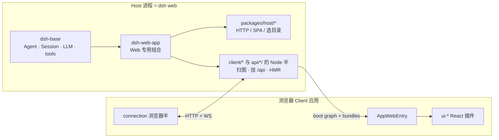

# 004 · Web UI：宿主进程 + 浏览器双进程

> DeepSeek Harness 源码专题 · 第 4 篇
> 接 [003 · 解剖 apps/web](./003-解剖apps-web前端仓库.md) · 呼应 [001 · hi 对话](./001-一次hi对话的源码之旅.md) · 流程见 [000](./000-当前项目开发流程.md)
> 主线：进程怎么拆、线怎么通、插件为何是 dual-face、HMR 热的是哪一半

[003](./003-解剖apps-web前端仓库.md) 说明了「前端货架不在 `apps/web`」。
本篇往上抽一层：**Web UI 不是单页应用，而是「Node 宿主进程 + 浏览器 Cordis 应用」**——宿主持有 Agent 与能力，浏览器是 React 插件外壳，中间靠连接层说话。

权威深读：[docs/subsystems/web-client](../docs/subsystems/web-client.md)、[`client/connection`](../packages/client/connection/README.md)、[`client/modules`](../packages/client/modules/README.md)、[`client/hmr`](../packages/client/hmr/README.md)。

---

## 先说结论

| 说法 | 精确含义 |
|---|---|
| 「双进程」 | **一个** Node Host 进程（`dsh web`）+ **一个**浏览器里的 Client Cordis 应用 |
| 「宿主持有 agent」 | Host **进程**里的 `dsh-base` + core/llm/session…；**不是**目录 `packages/host/` 独自养 Agent |
| 「`packages/host/`」 | Host 半里的 **HTTP / SPA / 目录选择**（`webserver`、`frontend-static`…） |
| 「`packages/client/`」 | 浏览器半：boot 壳、连接、slots、各 `ui-*` |
| 「dual-face」 | **同一 npm 包**既有 Node 半（`src/` → Loader）又有浏览器半（`src/client/` → `lib/client.js`） |
| 「HMR」 | `pnpm run dev:web` 重写插件 `lib/client.js` 后，`dsh-client-hmr` **就地换插件**；connection / Session 数据层不动 |

一句话：

> **真相与执行在 Host 进程；浏览器只镜像状态、画 UI、把命令打回去。**

---

## 1. 双进程一图

```text
┌──────────────────────────── Node 进程（dsh web）────────────────────────────┐
│  profile = dsh-base  ⊕  dsh-web-app                                         │
│                                                                              │
│  ┌─ 产品权威 ─────────────────┐   ┌─ Web 载体（packages/host + …）────────┐ │
│  │ Agent / agent-loop         │   │ webserver · frontend-static           │ │
│  │ Session 持久化 · LLM       │   │ client-modules（扫 dsh.client → 图）  │ │
│  │ tools · shell · permission │   │ client-connection Host 半（/api）     │ │
│  │ api/*-controller Host 半   │   │ client-hmr · directory-picker …       │ │
│  └────────────────────────────┘   └───────────────────────────────────────┘ │
│         ▲ 权威 mutation / stream 生产              │ 注入 HTML               │
│         │                                          ▼                         │
│         │                    window.__DSH_BOOT__ + __ModuleLoader__          │
│         │                    + /plugins/<id>/client.js + SPA dist            │
└─────────┼──────────────────────────────────────────┼─────────────────────────┘
          │ HTTP POST /api/... （一元 Remote）        │
          │ WS /api/remote.mux （流 / generation）    │
┌─────────┼──────────────────────────────────────────┼─────────────────────────┐
│  浏览器 │                                          ▼                         │
│         │   AppWebEntry → 模块表 → Cordis Loader → ui-renderer(root)         │
│         │                                                                    │
│  ┌─ 连接与镜像 ──────────────┐   ┌─ React 外壳（slots）───────────────────┐ │
│  │ connection Client 半      │   │ ui-layout · ui-conversation · ui-chat  │ │
│  │ api-remotes → ctx.remote  │   │ ui-tool · ui-settings · …              │ │
│  │ session-controller/client │   │ 组件只吃派生 props，永不碰 Host ctx    │ │
│  │ （Sessions → Session）    │   └────────────────────────────────────────┘ │
│  └───────────────────────────┘                                               │
└──────────────────────────────────────────────────────────────────────────────┘
```

和 [001](./001-一次hi对话的源码之旅.md) 对齐：你在输入框发 `hi`，浏览器只调用 Client 侧的 `Session.prompt`；真正 `Agent.followup`、落盘、调模型，全在 **Host 进程**。

---

## 2. 两个容易混的「Host」

口语里「Host」经常指两件不同的事：



| 名字 | 目录 / 组合 | 拥有什么 |
|---|---|---|
| **Host 进程** | `dsh --profile web` = base + web-app | 权威状态、Agent、持久化、mutation、stream 生产 |
| **`packages/host/`** | `webserver`、`frontend-static`、`directory-picker*`… | 纯 Node HTTP 载体与 SPA 静态回退等——**不养** Agent |
| **Client 应用** | `packages/client/*` + `api/*/client` | 连接、镜像 model、Slots、React |

所以：「宿主持有 agent 与能力」✅；「能力都写在 `packages/host/`」❌。

---

## 3. 连接层：浏览器怎么跟宿主说话

包：`@deepseek-ai/dsh-client-connection`（**本身就是 dual-face**）。

| 方向 | 载体 | 谁拥有 |
|---|---|---|
| 一元 Remote（list / create / prompt…） | **HTTP POST** ` /api/<namespace>/<method>` | Connection Host 半挂唯一 `/api` |
| 流 / generation / 事件转发 | **WebSocket** `/api/remote.mux` 上的逻辑流 | **API Gateway** 拥有 mux；Connection 管 generation、重连、信任 |
| Session 日志导出、上传等 | 精确 Fetch 路由 | 功能包登记；未认领 → 404 |

浏览器侧挂 `ctx.connection`：generation、恢复状态、`rpc`、`reconnect()`、generation source 注册点。

业务不直接「手搓 fetch」：

```text
UI / Conversation
  → ctx.sessions / Session.prompt · follow   （api/session-controller 的 Client model）
  → ctx.remote.<ns>.…                        （api-remotes 组装的生成面）
  → connection（HTTP unary + Gateway WS）
  → Host controller / Agent
```

信任边界（摘要）：启动 URL 带一次性 `?token=` → 换 HttpOnly cookie；之后 RPC/WS 认 cookie；Host/Origin 检查挡 DNS rebinding；静态资源可公开。细节见 connection README。

跟流心智（对照 001）：

1. `Session.prompt(...)` — 用户提交（unary Remote）
2. `follow()` — 打开事件流：首帧 opening snapshot，再 append live
3. `page()` / `loadOlder` — 更早历史与缺口修补
4. control stream — 每代完整 baseline，再增量 queue / jobs / projection

**Host 决定持久结果；Client model 只维护最新可用镜像**——没有第二份业务真相。

---

## 4. Dual-face：一个包，两张脸

「dual-face」在本仓库 = **同一 `@deepseek-ai/dsh-*` 包同时服务 Host Loader 与浏览器模块表**。

典型布局：

```text
packages/client/<name>/          # 或少数 api/*、host 侧伴侣
├── src/
│   ├── index.ts                 # Node 半：Loader 插件（可很薄 / 空 apply）
│   └── client/
│       ├── index.ts             # 浏览器半：apply / slots.register / React
│       └── …
├── lib/
│   ├── index.js                 # Host 阶段产物
│   └── client.js                # ★ 浏览器加载的就是它（/plugins/...）
├── package.json                 # exports["./client"] + dsh.client
└── tsdown.config.ts             # clientBundle(...)
```

`package.json` 关键字段：

```json
{
  "exports": {
    ".": { "default": "./lib/index.js" },
    "./client": { "default": "./lib/client.js" }
  },
  "dsh": {
    "client": {
      "platform": "web",
      "immediately": false,
      "inject": ["@deepseek-ai/dsh-client-connection"]
    }
  }
}
```

| 字段 | 作用 |
|---|---|
| `exports["./client"]` | 构建出的浏览器入口；缺了 scan 会炸 |
| `dsh.client.platform` | 固定 `'web'` |
| `dsh.client.immediately` | 是否进 boot 第一批 prefetch（基础设施才开） |
| `dsh.client.inject` | **信息边**（预检展示、HMR diff）——**不**决定 Cordis 激活顺序 |
| `dsh.client.external` | 模块表上的非基线 `require`；功能插件默认不该靠它互取运行时值 |

构建面：根脚本按 `DSH_BUILD_FACE=host|client` 分阶段；普通 Client 插件在 **Client 阶段**同时打出 Node loader 与 `lib/client.js`。

经典 dual-face 对照：

| 包 | Node 半 | 浏览器半 |
|---|---|---|
| `client/modules` | `ctx.clientModules`：扫图、喂 `/plugins`、写 boot graph | `ctx.modules`：lazy CJS 模块表 |
| `client/connection` | `/api`、信任、cookie、精确路由 | fetch / WS 客户端、`ctx.connection` |
| `client/hmr` | 挂 Host、推 SSE 重建事件 | 收事件、就地换插件 |
| 多数 `ui-*` | 常为极薄 / 空 Host apply | slots + React 组件 |
| `api/session-controller` | Host commands + stream 生产 | `Sessions → Session` 镜像 |

花名册不在 `apps/web`：`packages/bundle/web-app/cordis.patch.yml` 里的 Host insert 行 + `dsh.client` 行，决定默认 Web 挂哪些半边。

---

## 5. Boot：Host 如何把 Client「种」进浏览器

```text
dsh web
  → Host 扫启用条目的 dsh.client
  → 组成 WebBootGraph
  → index 注入：
        window.__DSH_BOOT__      // 插件花名册
        window.__ModuleLoader__  // 模块表门面
  → 托管 apps/web/dist + /plugins/<id>/client.js
  → 浏览器 main.ts → new AppWebEntry(#root).run()
        1) module stage：建表、prefetch immediately
        2) plugin stage：Cordis Loader，等全部 ACTIVE
        3) ui-renderer.renderSlot('root')
```

没有这两全局，裸 Vite serve 会被配置拒绝——[003](./003-解剖apps-web前端仓库.md) 已写。

壳与平台表：`packages/client/web` 的 `PLATFORM_MODULES`（React / Cordis / 静态 UI 库）种子进模块表；动态插件把它们当 **externals**，避免每包打一份 React。

---

## 6. HMR：热的是插件脸，不是整页、也不是 Session

开发组合：

```sh
pnpm dsh web          # 必需：Host + 注入 + 静态/插件服务
pnpm run dev:web      # 可选：watch 带 dsh.client 的包，重写 lib/client.js
```

链路：

```text
改 packages/client/ui-chat/src/client/...
  → dev:web / tsdown watch 写出新的 lib/client.js
  → Host modules 通知重建
  → /plugins/events（SSE）→ 浏览器 hmr
  → 卸载旧 fiber，加载新 bundle，依赖它的插件跟着重载
  → connection · runtime · Session 对象层保持不动
```

边界：

- **会热**：声明了 `dsh.client`、被 watch 重建的浏览器半
- **要整页刷新**：shell（`client/web`）、非 client 包、Host 侧逻辑、boot graph 结构性变化
- **生产**：无 watcher → HMR 空闲；模型看不见这套机械

所以迭代 UI 组件时，常见体验是「气泡样式秒变、对话状态还在」——因为数据层没被换掉。

---

## 7. 依赖方向（红线，跟读时用）

```text
Host 权威状态
  → Remote / Connection（线）
  → Client model（无 React）
  → UI adapter（ui-session / ui-workspace）
  → Conversation / 展示插件
  → Slots
  → React 组件（纯 props）
```

反向上行：用户手势 → inject 回调 / `ctx.sessions` / `ctx.remote` → 再回 Host。

组件 **永不**接收 Cordis `ctx`、transport 对象、或别的功能插件实现。跨功能 UI 只走 **slots**；跨功能行为只走 **注入的 Cordis service**。

---

## 8. 跟读时怎么落目录

| 你想搞清… | 打开 |
|---|---|
| 进程谁启动、挂哪些 Host 行 | `apps/cli`、`packages/bundle/web-app/cordis.patch.yml` |
| HTTP 端口与 index 注入 | `packages/host/webserver`、`frontend-static`、`client/modules` Node 半 |
| 浏览器如何 boot | `packages/client/web`（`AppWebEntry`） |
| 线与信任 | `packages/client/connection` |
| prompt / follow 镜像 | `packages/api/session-controller/src/client/` |
| 热更新 | `packages/client/hmr` + `pnpm run dev:web` |
| 页面长什么样 | `packages/client/ui-*` + slots |

本地改 UI 的最短证据梯（见 `packages/client/AGENTS.md`）：`pnpm run test:gui` → 可见输出再 `DSH_SNAPSHOT=replay pnpm run test:web`。

---

## 9. 和本专题其它篇

| 篇 | 本篇补什么 |
|---|---|
| [001](./001-一次hi对话的源码之旅.md) | 把「浏览器半边」钉在 connection + Client Session 上 |
| [002](./002-目录结构与架构图.md) | 分清 `host/` 组 vs Host 进程 vs `client/` 组 |
| [003](./003-解剖apps-web前端仓库.md) | 003 拆货架；本篇拆**进程与线** |
| [010 · Host 启动顺序](./010-Host端内部启动顺序.md) | Host 进程从 argv 到 appReady（再到首个 preset）的时序 |

---

*本文为 wiki 专题稿；传输路径与 dual-face 约定以 `docs/subsystems/web-client`、connection/modules/hmr README 与当前 `web-app` patch 为准。*
