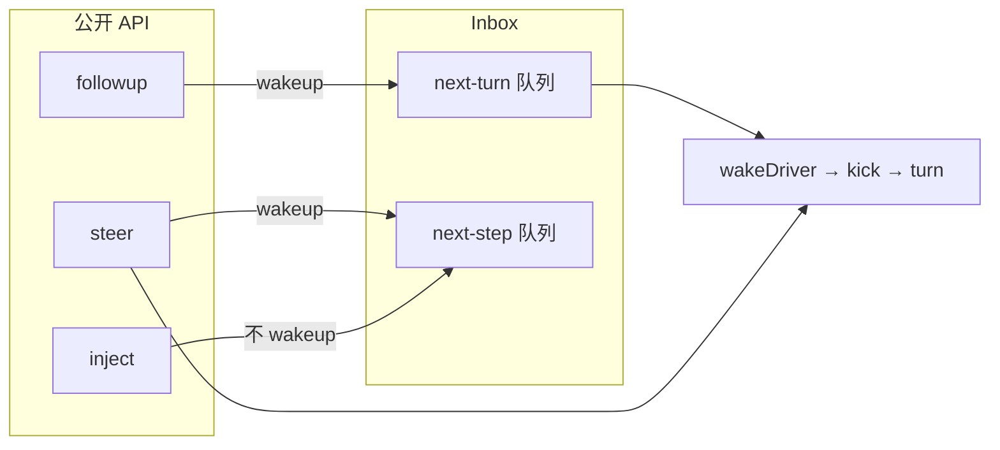
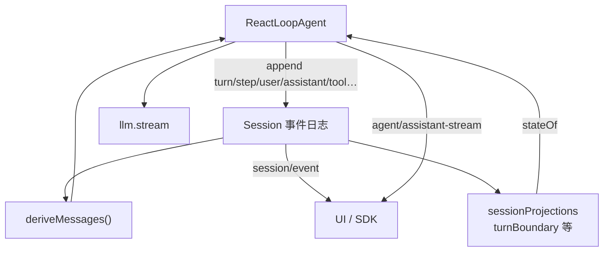

# 005 · 解剖 AgentLoop

> DeepSeek Harness 源码专题 · 第 5 篇
> 接 [001 · hi 对话](./001-一次hi对话的源码之旅.md) · 地图见 [002](./002-目录结构与架构图.md) · 流程见 [000](./000-当前项目开发流程.md)
> 主线：谁是工厂、谁是司机、Turn/Step/Inbox 如何咬合、扩展该挂哪

[001](./001-一次hi对话的源码之旅.md) 顺着 `hi` 走过一遍 Agent 驱动；本篇把 **`dsh-agent-loop` 整包拆开**——它不是「多写几层 if」的聊天循环，而是：**工厂造 Agent，司机跑 Turn/Step，一切可观察效果进 Session 日志或 `agent/*` 事件**。

权威深读：

| 入口 | 管什么 |
|---|---|
| [`packages/core/agent-loop/README`](../packages/core/agent-loop/README.md) | 包合同：配置、创建/恢复、步内行为 |
| [`docs/architecture.md` · Turn flow](../docs/architecture.md#turn-flow) | 官方 Turn/Step 叙事 |
| [`docs/agent-lifecycle.md`](../docs/agent-lifecycle.md) | 生成的时序图 |
| [`docs/subsystems/core.md`](../docs/subsystems/core.md) | `Agent` 句柄、创建所有权、拦截契约 |
| [`packages/core/agent`](../packages/core/agent/README.md) | 公开 `Agent` 接口与 Inbox（驱动实现者不外泄） |

---

## 先说结论

| 名字 | 它是什么 |
|---|---|
| **`AgentLoop` 服务** | Cordis 插件 `ctx.agentLoop`；实现 `AgentFactory`，挂到 `ctx.agents.setFactory()` |
| **`ReactLoopAgent`** | 包内私有司机；真正实现公开 `Agent`（inbox / followup / turn / step） |
| **`ctx.agents`** | 对外唯一入口：`create` / `resume` / `get`；消费者 **不** import `agent-loop` |
| **Turn** | 零或多步：先开 `turn/start`，再认领输入；没事可欠时关 `turn/end` |
| **Step** | 一次模型请求 + 它触发的工具调度 |
| **Inbox** | 两队列：`next-turn`（醒司机开新轮）与 `next-step`（同轮续步 / 注入） |

一句话：

> **插件改行为，挂在 `agent/*` / `tools/*` / Session 事件上；改循环本体前先改 `docs/architecture.md`。**

---

## 1. 两层：工厂 vs 司机

```text
                    ctx.agents.create / resume / config agents
                                    │
                                    ▼
┌────────────────────── AgentLoop（Service + AgentFactory）──────────────────────┐
│  prepare()：Session + ReactLoopAgent + Scope + 回滚事务                         │
│  发布：session/created → agent/created → agent/session-start → 启动司机         │
│  配置：maxParallelToolCalls · agents[] 启动                                     │
└───────────────────────────────────┬────────────────────────────────────────────┘
                                    │ 交出 Agent 句柄 / 自行托管 config agent
                                    ▼
┌────────────────────── ReactLoopAgent（implements Agent）───────────────────────┐
│  Inbox · phase(idle|maintenance|running) · kick → while turn()                  │
│  turn → preStep → step →（工具）→ 可能再 step → turn-stopping → turn/end         │
└────────────────────────────────────────────────────────────────────────────────┘
```

| 文件 | 角色 |
|---|---|
| [`src/index.ts`](../packages/core/agent-loop/src/index.ts) | `AgentLoop`：工厂、配置、声明式启动、`turnBoundary` 投影 |
| [`src/agent.ts`](../packages/core/agent-loop/src/agent.ts) | `ReactLoopAgent`：Inbox、相位机、Turn/Step |
| [`src/tool-calls.ts`](../packages/core/agent-loop/src/tool-calls.ts) | 工具：独占屏障 + 有界并行池 |
| [`src/assistant-stream.ts`](../packages/core/agent-loop/src/assistant-stream.ts) | 进程内跟流帧 → 落盘 `assistant/message` / `attempt` |
| [`src/runtime-context.ts`](../packages/core/agent-loop/src/runtime-context.ts) | 运行时上下文快照（进 pre-step 消息） |
| [`src/invariant.ts`](../packages/core/agent-loop/src/invariant.ts) | 「模型可见 ⟺ 日志可重建」不变量 |

和 `dsh-agent` 的分工：

- **`dsh-agent`**：声明 `Agent`、`Inbox`、`agent/*` 事件、`ctx.agents` 注册表
- **`dsh-agent-loop`**：唯一默认实现；换循环 = 另实现 `Agent` + `setFactory`，产品插件仍只依赖 `agent`

---

## 2. 输入怎么进循环：三条预设 + 一个统一 `send`

```ts
// packages/core/agent-loop/src/agent.ts
send(message, target, wakeup): void {
  this.inbox.splice(/* … */, [message])
  if (wakeup) this.wakeDriver(/* … */)
}

followup(input)  // → next-turn,  wakeup=true   普通排队提示
steer(input)     // → next-step,  wakeup=true   跑着插话，进当前轮下一步
inject(input)    // → next-step,  wakeup=false  静默注入，等人叫醒再进模型
```



认领规则（`Inbox.claim`）很关键：

1. **总是先清空** `next-step`（本步全部注入 / 插话 / 工具结果上下文）
2. 若目标是 `next-turn`，再 **额外取出一条** `next-turn` 提示

因此：

| 场景 | 效果 |
|---|---|
| 空闲发 `hi` | `followup` → 开 turn → 认领那条用户消息 |
| 模型还在跑时插话 | `steer` → 进 `next-step` → 本 step 结束后同 turn 再开一步 |
| 插件塞上下文 | `inject` → 等别人唤醒；不单独开 turn |
| 取消默认 | `cancel` 清空 Inbox（除非 `keepInbox`）并 abort 当前活动 |

---

## 3. 相位机：`idle` / `maintenance` / `running`

司机一生只服务一个 Session；热路径用相位表示「有没有活动」：

| Phase | 含义 |
|---|---|
| `idle` | 无活动；`wakeDriver` 可开新司机 |
| `running` | `kick` 在跑：`while (await turn())` |
| `maintenance` | `runMaintenance` 占用；唤醒先锁存，维护结束后再播 |

`wakeDriver` 要点：

- **idle**：升到 `running`，`withInitiator(agent, kick)`
- **已在跑且未 abort**：不另开司机——活着的司机自己会再 `claim`
- **maintenance 或 abort 后的唤醒**：置 `wakeRequested`，收敛后再播（避免丢叫醒）

`status` 对外只有 `idle | running`（maintenance 对外仍算 idle）。

---

## 4. Turn 骨架（比 hi 多一步工具）

官方骨架在 [architecture.md](../docs/architecture.md#turn-flow)；这里对齐源码读：

```text
wakeDriver → kick
  while turn():
    turn/start
    target = next-turn          # 本轮第一步
    loop:
      preStep(target):
        claim(inbox)
        systemPrompt.assemble
        agent/pre-step waterfall → reject | enter(messages, startsRequestSeries?)
      reject / 首步空消息 → 关 turn（可能 0 次模型调用）
      step/start
      append 每条 enter 的 user/message     # 先落盘，再调模型
      step():
        buildRequest → llm.stream → assistant/message|attempt
        若有 tool-call → executeToolCalls → 可能 return null（还欠下一步）
      step/end
      若已结束且 next-step 空 → agent/turn-stopping → break
      否则 target = next-step，继续同 turn
    turn/end { reason }
    若 inbox 还有 pending → 新 AbortController，return true（再开一轮）
    否则 return false → kick 退出 → idle
```

`TurnEndReason` 常见取值（概念层）：

| kind | 典型来源 |
|---|---|
| `completed` | 模型无工具 / 工具声明收束 / 空首步 |
| `blocked` | `agent/pre-step` reject |
| `max-tokens` | 任一步触顶（粘性，后续 completed 不降级） |
| `aborted` | `cancel` / dispose |
| `error` | 未处理的请求/扩展失败 |
| `interrupted` | **仅 resume 补写**：崩溃留下的开着的 turn（循环本身不发） |

---

## 5. `preStep`：认领 + 组装 + 决策

```ts
const claimed = this.inbox.claim(target, position.turn)
const assembly = await this.loopCtx.systemPrompt.assemble(...)
const decision = await this.dispatch.waterfall(
  'agent/pre-step', { messages: claimed, ...position, signal },
  () => Promise.resolve({ kind: 'enter', messages: claimed + 可选 runtime context }),
)
```

| 步骤 | 作用 |
|---|---|
| `claim` | 从 Inbox 取出本步候选用户消息 |
| `assemble` | 收集各插件的 prompt 段与可见工具 schema |
| `agent/pre-step` | 插件可改写 / 拒绝；默认 `enter` |
| `startsRequestSeries` | 可选：开新模型消息系列 → 可能记新 `request/header` |

原则再次出现：**模型可见 ⟺ 已记 Session**。`enter` 通过后立刻 `user/message` 落盘，然后才 `step()`。

---

## 6. `step`：请求、跟流、工具、重试

### 6.1 拼请求

```ts
const system = renderPrompt(assembly)
const { request, preparedCall } = await this.buildRequest(
  turn, step, assembly.tools, system,
  this.session.deriveMessages(),  // 从日志投影历史，不是旁路数组
  startsRequestSeries, surfaceGeneration, signal,
)
```

`buildRequest` 经 `agent/request` waterfall + `llm.prepareCall`：校验适配器字段、解析 reasoning / maxTokens 默认值，并在需要时写 `request/header`。

### 6.2 流式与结算

- `AssistantStreamAttempt` 发进程内 `agent/assistant-stream`（Web 跟流几乎只靠它）
- 成功 → 耐久 `assistant/message`（内嵌紧凑 stream）
- 失败 / 取消无前缀 → `assistant/attempt`（不进模型历史）
- 取消但已有可见文本 → 带 `interrupted: true` 的 `assistant/message`（用户看见的要进下一请求）

终端适配器失败走 `agent/request-error`：监听器可返回 `{ kind: 'retry' }`（且不调 `next()`）；否则抛出，关 turn。

### 6.3 有工具时

```ts
const toolCalls = message.content.filter(b => b.type === 'tool-call')
if (toolCalls.length === 0) return { kind: 'completed' }
const { concluded } = await executeToolCalls(..., context =>
  this.inbox.splice('next-step', ..., [context]))
return concluded ? { kind: 'completed' } : null  // null → 同 turn 再 step
```

[`tool-calls.ts`](../packages/core/agent-loop/src/tool-calls.ts) 调度契约：

- **`exclusive`**：屏障，单独跑完再继续
- **`parallel`**：有界滚动池，上限 `maxParallelToolCalls`（默认 10；settings 可热改下一组）
- 策略 / 结果 / result-context **仍按模型顺序**提交
- 取消：已启动的 drain；未启动的写合成 `ABORTED_BEFORE_DISPATCH` 结果，保证回放合法

---

## 7. 创建、恢复、声明式 agent

```text
ctx.agents.create({ sessionId, agentOptions, setup?, seed?, meta? })
  → AgentLoop.create → persistence.create? → prepare → setup → 发布 → 开司机

ctx.agents.resume({ resumeSessionId, agentOptions, setup? })
  → persistence.open(write) → 读物理合法日志
  → 若尾部 turn 未闭合：追加 interruptedTurnClosers（缺的 tool 错、step/end、turn/end）
  → prepare 已恢复对象图 → 发布
```

要点：

- **创建是可回滚事务**：setup 失败 / 主人 dispose → 两边 id 都不发布
- **只有经 agent-loop 发布的 Session 才会持久化**（fork 也走 create + seed）
- **语义崩溃修复在 agent 层**，不是存储入口的职责
- cordis.yml 里 `agents[]`：无 `sessionId` 每次新 `${id}-session-<uuid>`；要稳定身份必须显式 `sessionId` / `resumeSessionId`

---

## 8. 扩展点地图（别改循环）

| 你想做的事 | 挂哪里 |
|---|---|
| 改本步进模型的消息 | `agent/pre-step` waterfall（记得 `next()`） |
| 改请求路由 / 参数 | `agent/request` |
| 换模型适配器 | `ctx.llm` + `llm/stream` |
| 拦截工具 | `tools/pre-execute` · `execute` · `post-execute` |
| 在 turn 末尾停住 | `agent/turn-stopping`（serial，无 `next()`） |
| 请求失败重试 | `agent/request-error` 返回 `retry` |
| 新模型可见输入 | 扩展 `SessionEventMap` + 从日志渲染 |
| 换整套循环 | 实现 `Agent` + `ctx.agents.setFactory` |

站立规则（根 `AGENTS.md`）：**新行为走文档化扩展点；改 `agent-loop` 必须更新 `docs/architecture.md`。**

---

## 9. 和 Session / 投影的关系



- **下一请求的历史**只来自 `deriveMessages()`
- **agent-loop** 注册共享 `turnBoundary` 投影，司机启动时读 `lastTurn`
- 不变量包断言：发给模型的请求能从日志重建

---

## 10. 跟读路径（建议顺序）

1. [`agent.ts` · `followup` / `wakeDriver` / `kick` / `turn`](../packages/core/agent-loop/src/agent.ts) — 相位与边界
2. [`preStep` + `step` + `buildRequest`](../packages/core/agent-loop/src/agent.ts) — 一次模型调用
3. [`tool-calls.ts`](../packages/core/agent-loop/src/tool-calls.ts) — 并行与取消
4. [`index.ts` · `prepare` / `create` / `resume`](../packages/core/agent-loop/src/index.ts) — 所有权与持久化接点
5. 对照 [001](./001-一次hi对话的源码之旅.md) 的最短路径，再想象「多一步 Bash」如何多开一个 step

可对照命令（需 `DEEPSEEK_API_KEY`）：

```sh
pnpm dsh --profile headless "用 Bash 列出当前目录"
# 或 Web：pnpm dsh web  — 看多步 turn 的 session 事件
```

---

## 11. 和本专题其它篇

| 篇 | 关系 |
|---|---|
| [001 · hi](./001-一次hi对话的源码之旅.md) | 最短路径：1 turn · 1 step · 0 tool；本篇补全工厂与多步 |
| [002 · 目录](./002-目录结构与架构图.md) | `packages/core/agent-loop` 在 core 脊柱上的位置 |
| [004 · 双进程](./004-Web-UI双进程与dual-face.md) | AgentLoop **只跑在 Host 进程**；浏览器只镜像 |
| [006 · Agent Presets](./006-四种Agent-Presets对比.md) | Loop 跑起来之后，会话实际挂了哪些工具/人设 |

---

*本文为 wiki 专题稿，整理自当前 checkout 的 `dsh-agent-loop` 源码与 `docs/architecture` / `docs/subsystems/core`；契约以包 README 与官方 docs 为准。*
