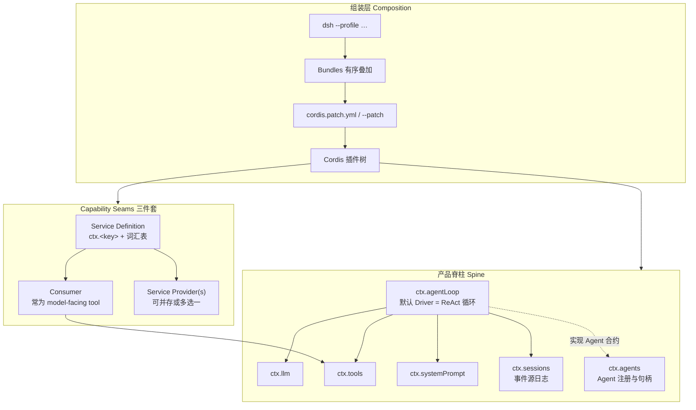
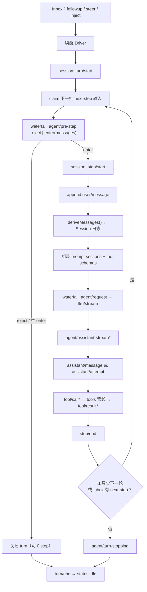
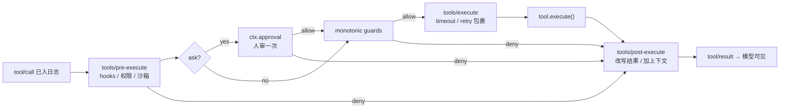
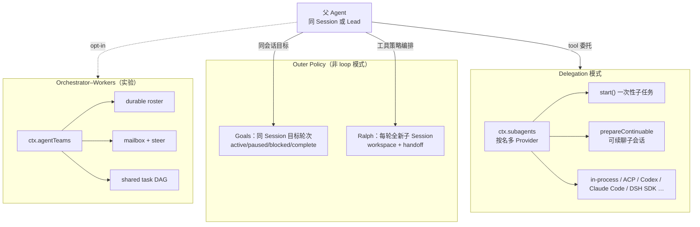
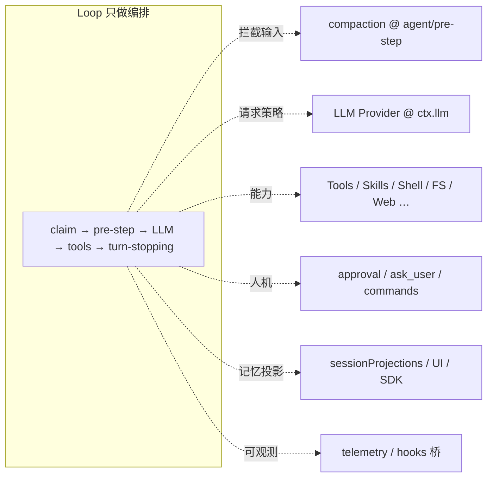

# 007 · Agent 设计模式流程图

> DeepSeek Harness 源码专题 · 第 7 篇
> 接 [005 · AgentLoop](./005-解剖AgentLoop.md) · [006 · Presets](./006-四种Agent-Presets对比.md) · 地图见 [002](./002-目录结构与架构图.md) · 流程见 [000](./000-当前项目开发流程.md)
> 主线：用业界常见 Agent 设计模式对照 dsh 落点，并画出分层流程图

DeepSeek Harness 的主轴不是单一「Agent 类」，而是 **可替换插件树 + 事件源 Session + 默认可换的 agent-loop**。
[005](./005-解剖AgentLoop.md) 解剖司机怎么跑；[006](./006-四种Agent-Presets对比.md) 说明会话装哪些能力；本篇回答：**这些机制分别对应哪些 Agent 设计模式？扩展该挂哪一层？**

权威入口：

| 入口 | 管什么 |
|---|---|
| [`docs/architecture.md`](../docs/architecture.md) | 组装、Turn flow、seam、扩展点地图 |
| [`docs/agent-lifecycle.md`](../docs/agent-lifecycle.md) | Turn/Step 时序图 |
| [`docs/tool-execution-pipeline.md`](../docs/tool-execution-pipeline.md) | 工具管线 waterfall / 审批 |
| [`docs/glossary.md`](../docs/glossary.md) | seam、scope、turn/step/round、Ralph、goal |
| [`docs/subsystems/subagent.md`](../docs/subsystems/subagent.md) | 委派多 Provider |
| [`docs/subsystems/agent-team.md`](../docs/subsystems/agent-team.md) | 实验性 Team 协作 |

---

## 先说结论

| Agent 设计模式 | 在 dsh 中的对应 | 关键入口 |
|---|---|---|
| **ReAct / Tool-use Loop** | `turn` ⊇ `step`：模型请求 → tool 批 → 再请求 | `ctx.agentLoop` |
| **Microkernel / Plugin** | 一切皆 Cordis 插件，含 loop 本身 | Profile / Bundle |
| **Capability Seam（策略 + DI）** | Definition / Provider / Consumer 三件套 | `ctx.llm`、`ctx.shell`、`ctx.subagents`… |
| **Event Sourcing** | 仅追加 Session 日志；模型可见 ⟺ 已记录 | `ctx.sessions` |
| **Chain of Responsibility** | waterfall：`agent/pre-step`、`agent/request`、`tools/*`、`llm/stream` | 事件扩展点 |
| **Delegation / Hierarchical Agents** | Subagent 多 Provider 共存 | `ctx.subagents` |
| **Orchestrator–Workers** | 实验性 Agent Teams（roster / mailbox / task DAG） | `ctx.agentTeams` |
| **Human-in-the-loop** | `ctx.approval`、`ask_user`、`ctx.commands` | interaction |
| **Context / Memory 管理** | system-prompt 组装、inject、compaction | `ctx.systemPrompt`、compaction |
| **Outer Policy Loop** | Goal rounds、Ralph（新会话轮次） | goals / workflow+subagent |
| **Scoped Composition** | 每 Agent 独立 `agent.ctx`（不向下继承） | scope |

一句话：

> **行为挂扩展点，不改 loop；换 Provider 即可换执行世界（本地 / 沙箱 / 远程产品）。**
>
> **Profile 决定装哪些 seam；Preset 决定本会话可见能力；Loop 只编排。**

---

## 1. 系统骨架：插件微内核 + Capability Seam



**读法：** Profile 决定「装哪些 seam」；loop 只编排；具体能力由 Provider 实现、由 Tool Consumer 暴露给模型。
Seam 的完整定义见 [`docs/glossary.md` · capability-seam](../docs/glossary.md#capability-seam)；图解目录见 [`docs/capability-seams.md`](../docs/capability-seams.md)。

---

## 2. 主循环：ReAct（Turn / Step）

与 [`architecture.md` · Turn flow](../docs/architecture.md#turn-flow) / [agent-lifecycle](../docs/agent-lifecycle.md) / [005](./005-解剖AgentLoop.md) 一致：



**模式对应：**

| 模式点 | 机制 |
|---|---|
| **ReAct** | step = 模型 Act + tool Observe，再进入下一步 |
| **Waterfall** | `pre-step` / `request` / `tools/*` 可改写或短路；监听者须 `next()` 才能委托 |
| **Event Sourcing** | 持久事实走 `session/event`；活体协调走 `agent/*` |
| **模型可见 ⟺ 已记录** | 新进模型上下文的输入必须有对应 Session 事件 |

---

## 3. Tool 管线：策略链 + HITL

详情见 [`docs/tool-execution-pipeline.md`](../docs/tool-execution-pipeline.md)：



这是 **Guardrails + Human-in-the-loop**，挂在工具 seam 上，不侵入 loop。
人命令（`ctx.commands`）走命令平面，**不**变成模型消息，与 tool 平面分开。

---

## 4. 多 Agent：委托、外环策略、协作



| 模式 | dsh 语义 |
|---|---|
| **Delegation** | 子 Agent 有独立 Session / lineage；scope **不**向子继承 |
| **Goal** | 同会话外环策略，不是第二个 loop |
| **Ralph** | 新鲜子会话轮次 + 结构化 handoff；见 [glossary · Ralph](../docs/glossary.md#ralph) |
| **Agent Teams** | Lead 协调多 teammate（实验）；见 [agent-team](../docs/subsystems/agent-team.md) |

层级词汇（turn / step / round）见 [glossary · loop hierarchy](../docs/glossary.md#loop-hierarchy)。

---

## 5. 横切关注点如何挂上（扩展地图）



与官方「Where new behavior goes」表对齐（完整表见 [`architecture.md`](../docs/architecture.md#where-new-behavior-goes)）：

| 目标 | 挂点 |
|---|---|
| 新模型适配器 | `ctx.llm` |
| 新模型可见能力 | `ctx.tools`（schema 进入 prompt 组装） |
| 拦截请求 / 工具 / 轮次 | `agent/*`、`tools/*`；`agent/turn-stopping` 停轮 |
| 注入上下文 | `agent.inject()`（下一轮 admitted 请求） |
| 持久状态 | 扩 `SessionEventMap`，从日志投影 |
| 换执行世界 | 换 FS / subprocess / sandbox Provider，消费者不必分叉 |

**不要默认改 `agent-loop`。** 改循环本体须同步更新 `docs/architecture.md`。

---

## 6. 一句话心智模型

```text
Profile 组装插件树
  → Agent 句柄 + 可换 Driver（默认 ReAct loop）
  → 每步：日志投影历史 → LLM → 工具管线（可 HITL）
  → 模型可见事实只来自 Session 事件源
  → 多 Agent = Subagent / Goal / Ralph / Teams，挂在 seam，不嵌进 loop 内核
  → Preset 决定本会话工具与提示词清单（见 006）
```

跟读路径建议：

1. [001](./001-一次hi对话的源码之旅.md) 走通一次对话
2. [005](./005-解剖AgentLoop.md) 看工厂 vs 司机
3. **本篇** 把机制映射到设计模式
4. [006](./006-四种Agent-Presets对比.md) 看会话装载差异
5. 需要落代码时回 [`docs/architecture.md`](../docs/architecture.md) 与对应子系统页

---

## 7. 和本专题其它篇

| 篇 | 关系 |
|---|---|
| [000 · 开发流程](./000-当前项目开发流程.md) | 改 seam / 事件 / 日志时证据落哪类测试 |
| [001 · hi](./001-一次hi对话的源码之旅.md) | 最短路径就是本篇 ReAct 主循环的一次实例 |
| [002 · 目录](./002-目录结构与架构图.md) | `packages/core`、`subagent`、`interaction` 等在包组中的位置 |
| [005 · AgentLoop](./005-解剖AgentLoop.md) | 本篇「ReAct」的源码解剖 |
| [006 · Presets](./006-四种Agent-Presets对比.md) | Composition 之后「本会话有哪些 Consumer」 |
| [004 · 双进程](./004-Web-UI双进程与dual-face.md) | Host 跑 loop/seam；浏览器消费投影与 Remote |

---

*本文为 wiki 专题稿，整理自当前 checkout 的 `docs/architecture`、`docs/agent-lifecycle`、`docs/glossary`、`docs/tool-execution-pipeline` 与相关子系统页；契约以那些权威源为准，随版本演进时以当前 checkout 核对。*
